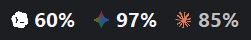
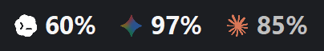
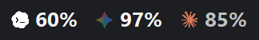
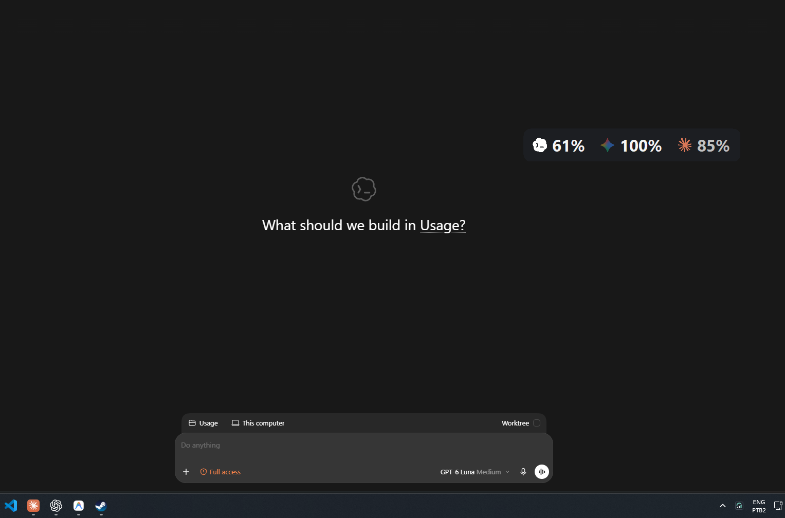
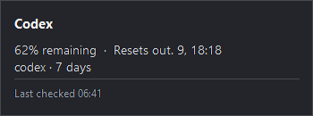
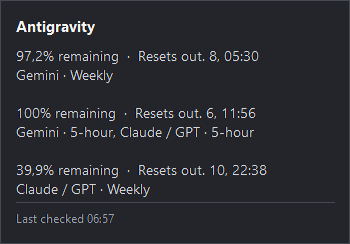
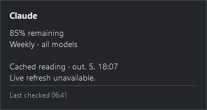
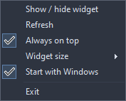
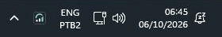

# HowsMyUsage

A tiny native Windows desktop widget for your AI subscription limits.

Just icons and remaining percentages, with rounded corners and no outline. Drag anywhere; hover for details. Stays behind your apps by default, or enable **Always on top** to keep it visible. A system tray icon, with no taskbar button. Built with C# / WinForms. No Electron, Tauri, WebView or runtime Node dependency.

## See it in action

### Three widget sizes

Right-click the widget or tray icon → **Widget size** → **Large**, **Medium**, or **Small**. Icons, text and spacing scale together, and the choice is saved across restarts. Tooltips stay readable at their normal size.

**Large — the original size (64 px tall at 100% Windows scaling)**

**Medium — 80% scale (51 px tall)**

**Small — 62.5% scale (40 px tall)**

These are actual application renders at the same Windows display scale. Width adapts to the displayed percentages.

### Always on top

Keep your remaining usage visible while you work in another app. Right-click the widget or tray icon and enable **Always on top**. The choice is saved across restarts; turn it off to return the widget to the desktop behind your apps.

### Usage at a glance

| Provider | Required source | Display |
| --- | --- | --- |
| Codex | Installed, signed-in Codex CLI/app-server | Lowest remaining account quota |
| Gemini | Running, signed-in Antigravity | Gemini shared weekly quota |
| Claude | Signed-in Claude Desktop | Weekly all-model quota remaining |

Percentages mean **remaining**, not consumed. Checked every two minutes. OpenCode, Go, Zen and OpenRouter are not currently supported.

### Codex

Hover Codex to see the remaining quota, reset time and last check.

### Gemini / Antigravity

The Gemini icon shows **Gemini weekly remaining**, not the five-hour window. Hover it to see both Antigravity pools: Gemini and Claude/GPT, each with weekly and five-hour limits. These pools are separate; Claude models inside Antigravity do not consume the Claude Desktop subscription shown by the separate Claude icon.

Weekly readings come from Antigravity's quota-summary endpoint. If weekly data is unavailable, the indicator shows a dash rather than substituting session usage.

### Claude Desktop

Claude shows the weekly all-model allowance. This example is a cached reading; the tooltip makes its age and unavailable live refresh explicit.

### Context menu

Refresh immediately, choose Widget size, switch Always on top, start with Windows, or exit—all from the same right-click menu.

### Windows system tray

HowsMyUsage is the dark gauge icon just to the right of the hidden-icons arrow. Left-click to show or hide the widget; right-click for the same context menu. Windows may place it in the hidden-icons area depending on your tray preferences.

Screenshots include application-rendered previews and actual Windows captures. Values are snapshots, not live repository data.

## Controls

- Drag anywhere to move when the position is unlocked.
- Hover the widget to reveal the top-right pin. Click to lock its position and prevent dragging; click again to unlock. The tooltip explains the current state, and the lock persists across restarts.
- Hover an icon or percentage for limits, reset times and last check time.
- Left-click the tray icon to show or hide.
- Right-click for Refresh, Widget size, Always on top, Start with Windows, and Exit.
- **Always on top** is saved across restarts. Turn it off to return to desktop-only mode.

Startup uses the current user's **UsageWidget** Run registry entry and a hidden PowerShell launcher. It waits 15 seconds for the desktop, retries failed starts and writes **startup.log** beside the app. Keep the installation drive available at sign-in. No service or scheduled task is installed.

## Install

1. Download **HowsMyUsage-1.0.3-win-x64.zip** from [Releases](https://github.com/DarlanSchwartz/HowsMyUsage/releases/latest).
2. Extract the entire ZIP to a writable folder on a drive other than C:.
3. Double-click **Install.cmd** and enter a destination such as **D:\Apps\HowsMyUsage**.
4. The installer copies the application and opens it. No administrator access or separate .NET installation required.

For a Desktop shortcut and automatic startup, open PowerShell in the extracted folder:

~~~powershell
powershell.exe -NoProfile -ExecutionPolicy Bypass -File .\install.ps1 -InstallDir 'D:\Apps\HowsMyUsage' -DesktopShortcut -StartWithWindows
~~~

The shortcut option explicitly permits writing to the Windows Desktop, which may be on C:. App files, settings and app-owned temporary files remain beside the executable. The app deliberately refuses to run from C:.

The installer is unsigned; Windows may show its standard download warning. Download only from this repository's releases. SHA-256 checksum files accompany releases.

**Portable:** run **app\Usage.exe** directly from the extracted folder. Keep the complete app folder together.

## Setup and limitations

**Codex:** sign in to Codex. The executable must be on PATH or in the supported OpenAI/Codex local installation folder. Existing CODEX_HOME is respected.

**Gemini / Antigravity:** open Antigravity and sign in. The widget reads the local language server's RetrieveUserQuotaSummary endpoint. Older versions without weekly summary support must be updated. The Gemini indicator uses only Gemini's weekly pool; the tooltip also includes the independent Claude/GPT pool and both five-hour windows.

**Claude:** the widget attempts to read Desktop's existing session in read-only mode and query usage. Desktop may lock its cookie database; unsupported cookie encryption can also prevent connection. If convenient, fully exit Claude Desktop, refresh the widget, then reopen Claude. Otherwise the widget may use a cached weekly reading from local history. The tooltip identifies cached readings and their original time. **Last checked is the query time, not proof that cached data is fresh.** Live Claude retrieval has not been validated on every Desktop version.

A dash means no usable quota. Gray values can indicate a cached reading or source error. Provider endpoints and local storage formats may change. This unofficial tool is not affiliated with OpenAI, Google or Anthropic.

## Privacy

No application analytics or telemetry is implemented. Authentication is read locally; you do not paste credentials into the widget. Claude session values are held in memory and sent only to claude.ai. Secrets are not intentionally written to settings or diagnostics. Queries retrieve status rather than generate model responses. Provider applications retain their own storage and logging behavior.

Never attach cookies, authentication files or unredacted account responses to issues.

## Update / uninstall

**Update:** exit from the tray and run the new release's installer with the same destination. Existing widget-settings.json is preserved.

**Uninstall:** disable Start with Windows, exit, delete the installation folder and remove the Desktop shortcut if created.

## Build

Requires Windows x64 and the .NET 10 SDK. Clone to a drive other than C:.

~~~powershell
git clone https://github.com/DarlanSchwartz/HowsMyUsage.git D:\Projects\HowsMyUsage
cd D:\Projects\HowsMyUsage
.\build.ps1
.\dist\widget\Usage.exe
~~~

Build caches and temporary files are redirected to .build inside the repo. Self-contained output is in dist/widget.

~~~powershell
# Parser checks plus real source queries; no model generation:
Start-Process .\dist\widget\Usage.exe -ArgumentList '--check' -Wait
# Exit the running widget first; render previews and verify desktop hosting:
Start-Process .\dist\widget\Usage.exe -ArgumentList '--check-widget' -Wait
# Package ZIP and SHA-256 checksum:
.\package.ps1 -Version 1.0.3
~~~

Checks write to artifacts. Source unavailability is separate from parser checks. Packaging uses the publish manifest, excludes debug symbols and does not package local settings, credentials, caches or diagnostics.

Assets are checked in. Node is needed only to regenerate them:

~~~powershell
npm ci --prefix tools --cache .build/npm
node tools/render-icons.cjs
node tools/render-app-icon.cjs
~~~

## License and credits

Original code: [MIT](LICENSE), copyright 2026 Darlan Schwartz.
Provider logos: [SVGL](https://svgl.app/). Trademarks belong to their respective owners.
See [third-party notices](THIRD-PARTY-NOTICES.md) and [licenses](docs/licenses/) for bundled runtime and build-tool licenses.

[Report a bug](https://github.com/DarlanSchwartz/HowsMyUsage/issues) with Windows version, provider and a redacted screenshot.
